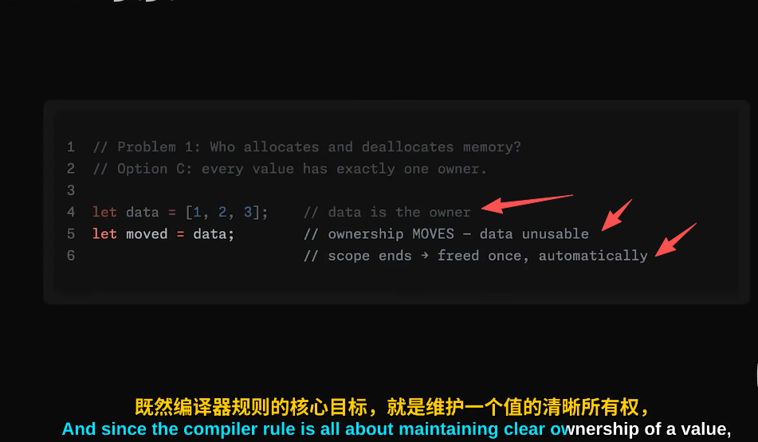
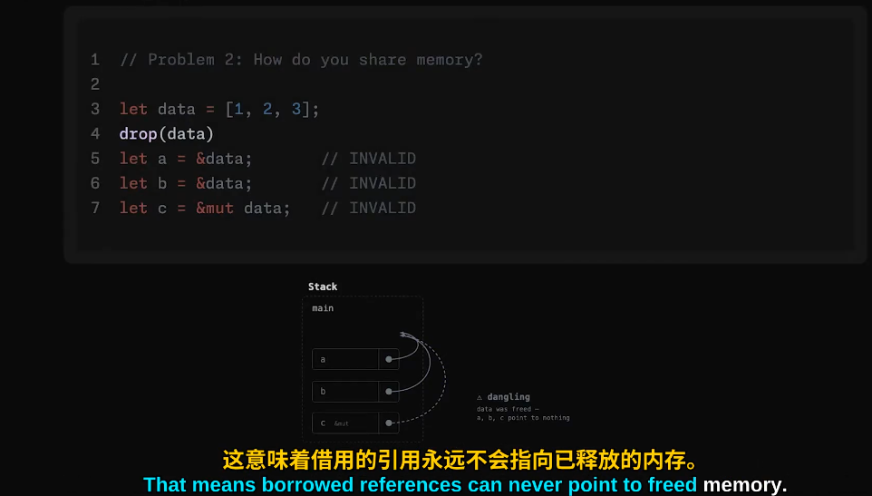
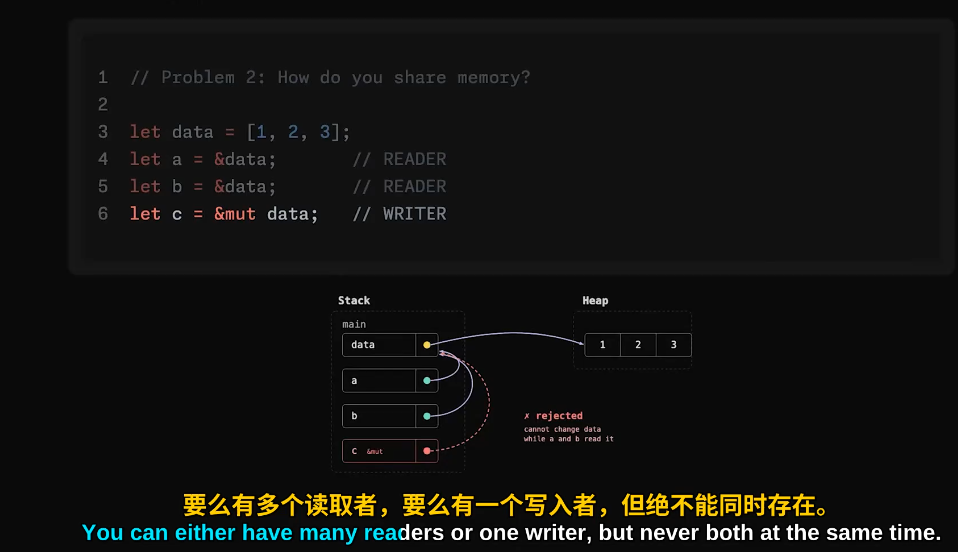
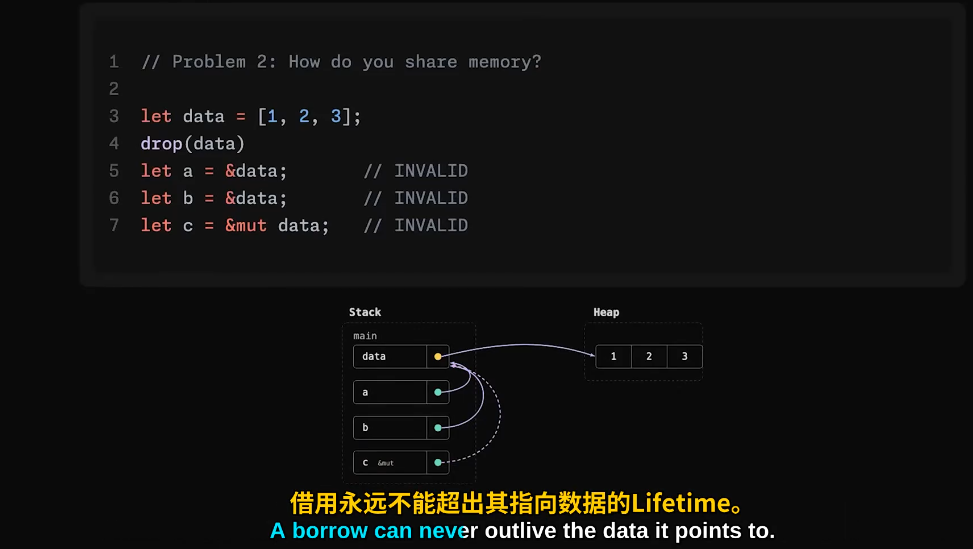
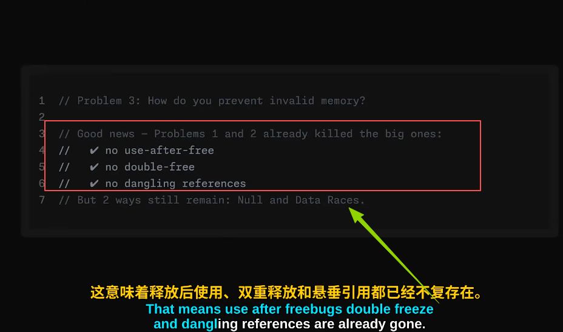

# Rust 内存模型的精妙之处：所有权与借用为何如此设计
|Fundamental questions（根本问题）|答案|说明|备注|
|-|-|-|-|
|- Who allocates and deallocates memory?（谁分配和释放内存？—— 编译器）把内存管理直接移到编译时来做|- 内存管理放到**编译期**完成给编译器添加步骤: **编译器强制要求一个值只有一个所有者**!!!所有者负责在不再需要时清理掉该值占用的内存空间(当值超过作用域，**编译器**会自动插入释放那块内存的调用)  |- 编译器的核心目标: 维护一个值的清晰所有权；|-  当把数据交给别人时，数据的所有权就转移到新变量上，所以始终只有一个所有者，负责释放这块内存(这个所有者负责在不再需要时清理掉该值占用的内存空间)[当打他变量超过作用域时，编译器会自动插入释放那块内存的调用——没有后台进程，也不需要手动释放——在编译时完成] -  , 参考:[000.RUST-DOCS/000.Rust-Ownership_所有权/README.md](../../000.RUST-DOCS/000.Rust-Ownership_所有权/README.md)|
|-|-|- 当你数据交给别人的时，数据的所有权就转移到新变量上，所以始终只有一个所有者|- 这样就解决了谁来分配和释放内存的问题|
|-|-|-|-|
|-|-|-|-|
|-|-|-|-|
|- How do you share memory?(如何共享内存) -- **借用规则**(编译时完成)|+ 借用规则:    - 允许程序的其他部分临时借用数据，而原始数据所有者仍保留所有权： 该操作可以让你引用数据，而不需要拥有他的所有权：可以使用数据，不需要负责清理他，数据仍属于原来的所有者  - 借用规则1： 要么有一个写入者，要么有多个读取者，但绝不能同时存在；    - 借用规则2： 借用永远不能超出其指向数据的Lifetime(编译器会校验)---悬垂引用变得不可能 ||-    -           |
|-|-|-|-|
|-|-|-|-|
|-|-|-|-|
|- How do you prevent invalid memory?|- 避免空指针： 不允许空值，将这种情况变为单独的类型： Optional程序在运行之前，把值缺失的情况处理掉    - 数据竞争： 借用规则已解决|-|-    编译器迫使我们先处理None情况，然后再拿到值本身   - |
|-|-|-|-|
|-|-|-|-|
|-|-|-|-|
|- 总结:|- 规则集： + 编译器强制每个值只有一个所有者，自动释放（由编译器，在编译期间，通过插入释放内存代码），这防止了双重释放和释放后使用错误， +再加上单一规则的借用，这既防止了悬垂引用，也让数据竞争不可能发生， +并且完全不引入空值(null),而是该用其他方式来处理，用一个独立的类型来表示一个可能存在也可能不存在的值（Optional类型），|-|-              |
|-|-|-|-|
|-|-|-|-|

## 参考资料
- [Rust 内存模型的精妙之处：所有权与借用为何如此设计｜中英双语](https://www.bilibili.com/video/BV1xSjX6qEDC/?spm_id_from=333.1391.0.0&vd_source=9eef164b234175c1ae3ca71733d5a727)

