# Rust 内存模型的精妙之处：所有权与借用为何如此设计
|Fundamental questions（根本问题）|答案|说明|备注|
|-|-|-|-|
|- Who allocates and deallocates memory?（谁分配和释放内存？）|- 内存管理放到**编译期**完成给编译器添加步骤: 编译器强制要求一个值只有一个所有者!!!所有者负责在不再需要时清理掉该值占用的内存空间(当值超过作用域，**编译器**会自动插入释放那块内存的调用)  |- 编译器的核心目标: 维护一个值的清晰所有权；|- 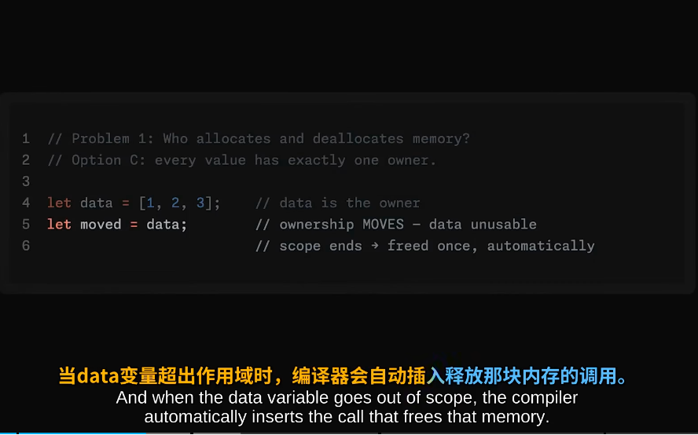 , 参考:[000.RUST-DOCS/000.Rust-Ownership_所有权/README.md](../../000.RUST-DOCS/000.Rust-Ownership_所有权/README.md)|
|-|-|- 当你数据交给别人的时，数据的所有权就转移到新变量上，所以始终只有一个所有者|- 这样就解决了谁来分配和释放内存的问题|
|-|-|-|-|
|-|-|-|-|
|-|-|-|-|
|- How do you share memory?(如何共享内存) -- **借用规则**|+ 借用规则:    - 允许程序的其他部分临时借用数据，而原始数据所有者仍保留所有权： 该操作可以让你引用数据，而不需要拥有他的所有权：可以使用数据，不需要负责清理他，数据仍属于原来的所有者  - 要么有一个写入者，要么有多个读取者，但绝不能同时存在；    - 借用永远不能超出其指向数据的Lifetime(编译器会校验)---悬垂引用变得不可能||- 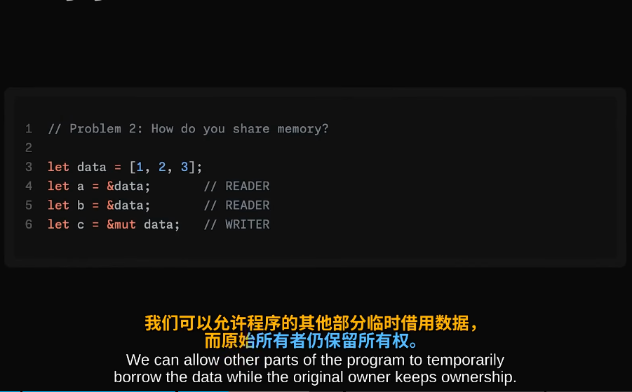   - 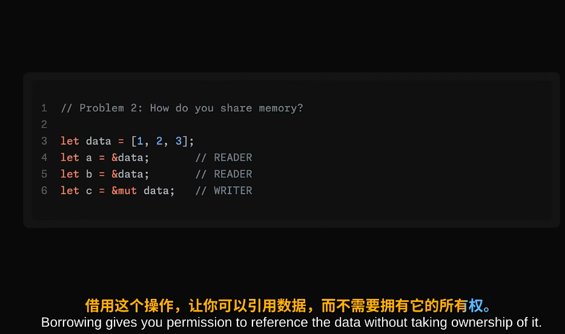  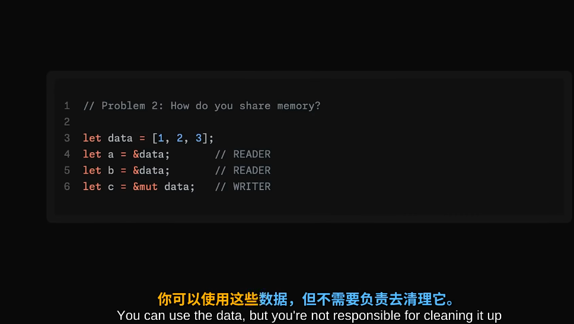  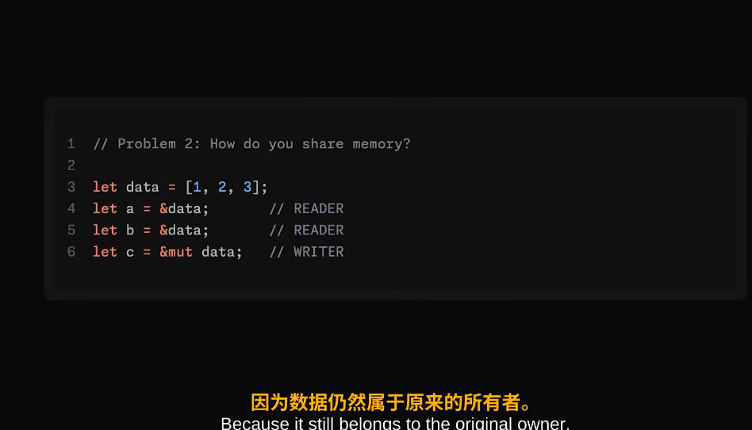  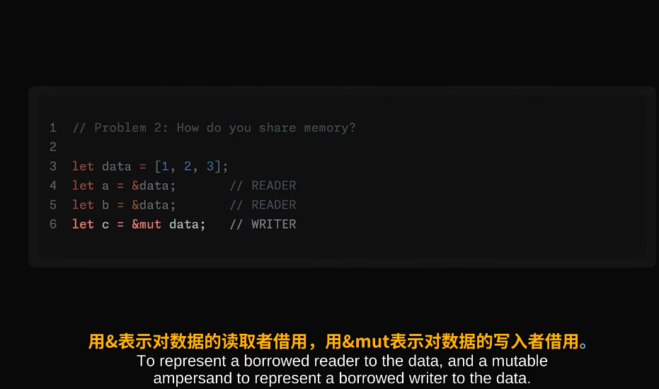  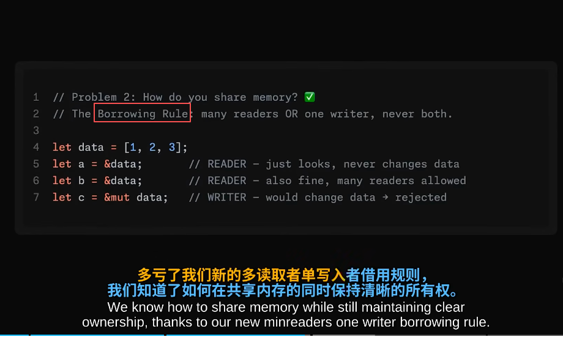|
|-|-|-|-|
|-|-|-|-|
|-|-|-|-|
|- How do you prevent invalid memory?|- 避免空指针： 不允许空值，将这种情况变为单独的类型： Optional    - 数据竞争： 借用规则已解决|-|- 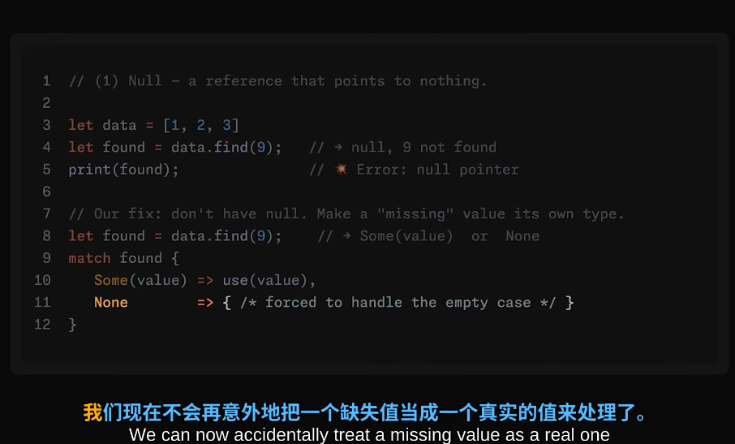   - 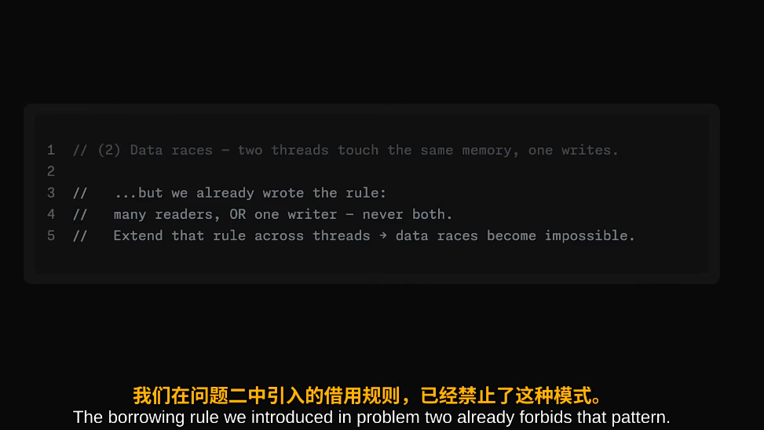|
|-|-|-|-|
|-|-|-|-|
|-|-|-|-|
|- 总结:|-|-|- 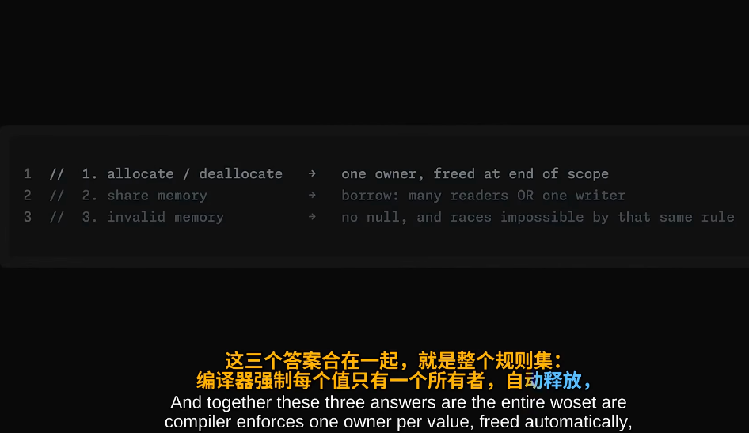   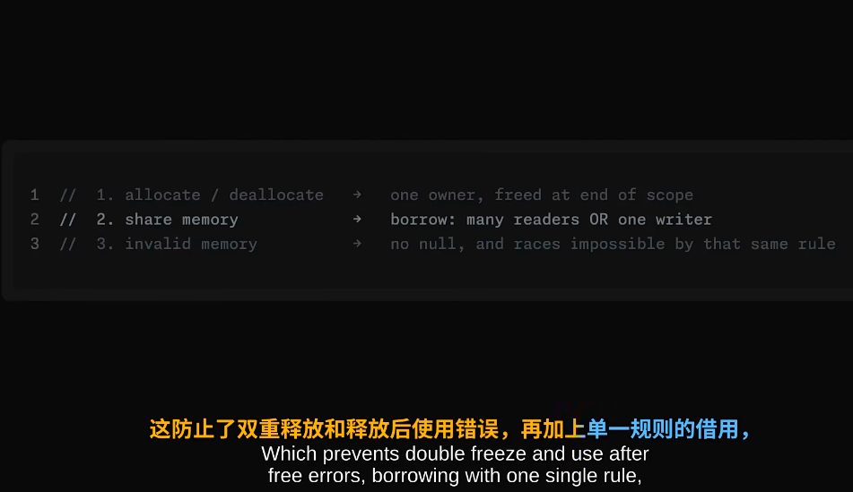   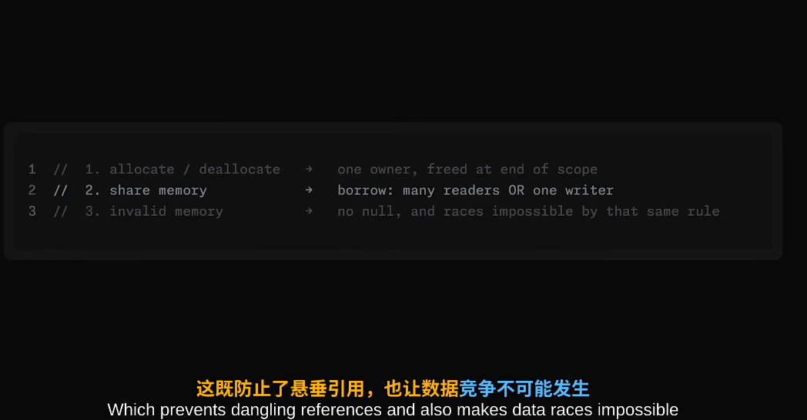   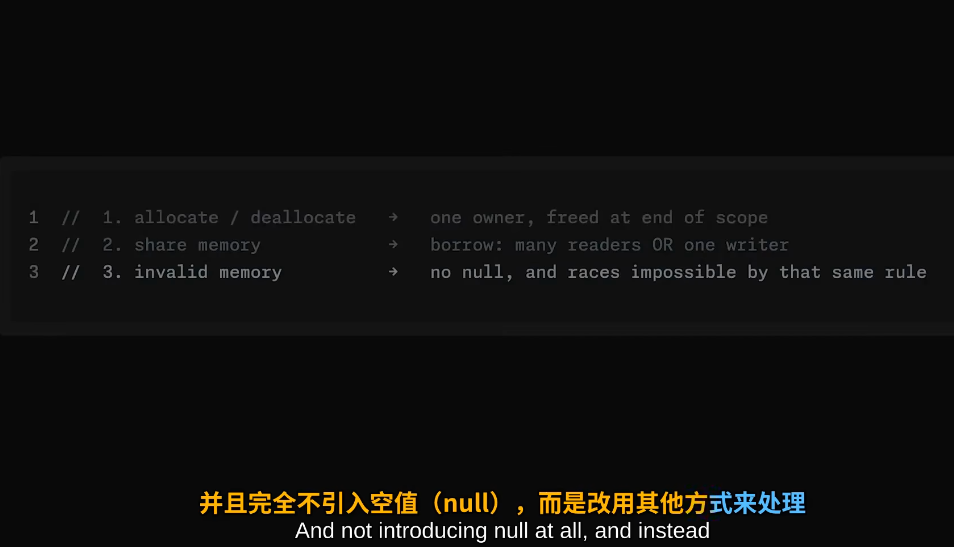  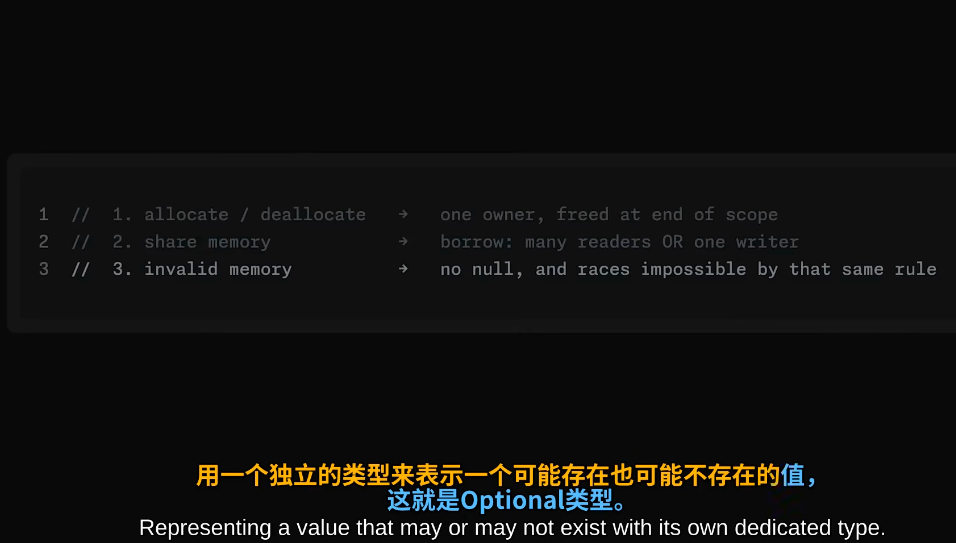  |
|-|-|-|-|
|-|-|-|-|

## 参考资料
- [Rust 内存模型的精妙之处：所有权与借用为何如此设计｜中英双语](https://www.bilibili.com/video/BV1xSjX6qEDC/?spm_id_from=333.1391.0.0&vd_source=9eef164b234175c1ae3ca71733d5a727)

